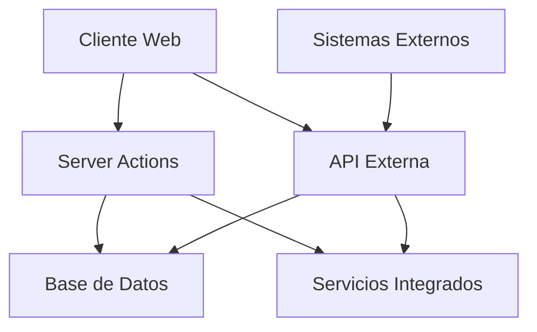
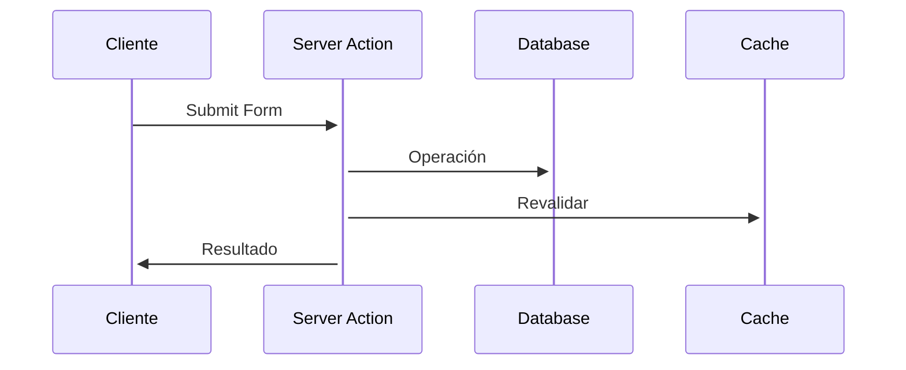
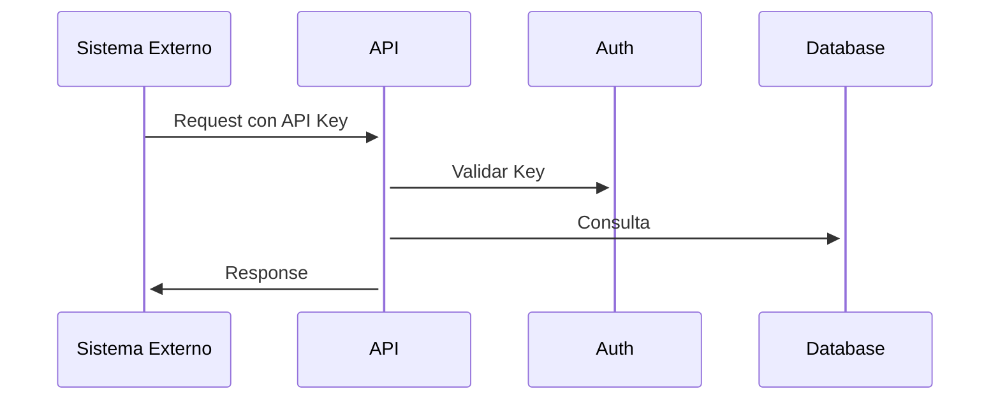

# Arquitectura de la Aplicación IT Support

## Enfoque Híbrido



## Estructura de Directorios

```
src/
├── actions/              # Server Actions (Lógica Principal)
│   ├── tickets/         # Acciones de tickets
│   ├── users/           # Acciones de usuarios
│   └── comments/        # Acciones de comentarios
│
├── api/                 # API Routes (Solo para integraciones)
│   ├── external/        # Endpoints para terceros
│   └── webhooks/        # Receptores de webhooks
│
├── app/                 # Next.js App Router
│   ├── dashboard/       # Dashboard principal
│   ├── tickets/        # Gestión de tickets
│   └── admin/          # Panel de administración
│
├── components/         # Componentes React
│   ├── ui/            # Componentes base UI
│   └── forms/         # Formularios con Server Actions
│
└── lib/               # Utilidades y configuración
    ├── auth/          # Autenticación
    └── integrations/  # Integraciones externas
```

## Flujos de Datos

### 1. Operaciones Internas (Server Actions)



### 2. Integraciones Externas (API REST)



## Capas de la Aplicación

1. **Presentación**
   - Components UI (Shadcn)
   - Server y Client Components
   - Forms con Server Actions

2. **Lógica de Negocio**
   - Server Actions (operaciones principales)
   - API Routes (integraciones)
   - Middlewares de seguridad

3. **Datos**
   - Prisma ORM
   - PostgreSQL
   - Redis Cache

## Patrones de Diseño

### 1. Server Actions para Operaciones CRUD
```tsx
// app/tickets/page.tsx
export default async function TicketsPage() {
  const tickets = await getTickets();
  
  return (
    <div>
      <TicketList tickets={tickets} />
      <CreateTicketForm />
    </div>
  );
}
```

### 2. API Routes para Integraciones
```typescript
// app/api/external/tickets/route.ts
export async function GET(request: Request) {
  const tickets = await getTicketsForExternal();
  return Response.json({ data: tickets });
}
```

### 3. Webhooks para Eventos
```typescript
// app/api/webhooks/ticket-updated/route.ts
export async function POST(request: Request) {
  const payload = await request.json();
  await processWebhook(payload);
  return new Response('OK');
}
```

## Seguridad

### 1. Server Actions
- Autenticación vía middleware
- CSRF protection automática
- Validación con Zod

### 2. API Externa
- API Keys
- Rate Limiting
- Validación de payload

## Escalabilidad

### 1. Caching
```typescript
// lib/cache.ts
export async function getTicketCache(id: string) {
  // Cache para Server Actions
  const cached = await redis.get(`ticket:${id}`);
  if (cached) return JSON.parse(cached);
  
  // Cache para API
  const ticket = await prisma.ticket.findUnique({ id });
  await redis.set(`ticket:${id}`, JSON.stringify(ticket));
  
  return ticket;
}
```

### 2. Background Jobs
```typescript
// jobs/notifications.ts
export async function processNotifications() {
  const notifications = await getNotifications();
  
  for (const notification of notifications) {
    if (notification.type === 'EXTERNAL') {
      await sendWebhook(notification);
    } else {
      await processServerAction(notification);
    }
  }
}
```

## Beneficios del Enfoque Híbrido

1. **Eficiencia**
   - Server Actions para operaciones rápidas y tipadas
   - API REST para compatibilidad con sistemas externos

2. **Seguridad**
   - Protección CSRF automática en Server Actions
   - Control granular en API externa

3. **Desarrollo**
   - DX mejorada con Server Actions
   - API clara para integraciones

4. **Rendimiento**
   - Menos JavaScript en el cliente
   - Caching efectivo

5. **Mantenibilidad**
   - Separación clara de responsabilidades
   - Código más limpio y organizado

6. **Integraciones**
   - Flexibilidad para sistemas externos
   - Webhooks para eventos en tiempo real

Esta arquitectura híbrida proporciona lo mejor de ambos mundos:
- Server Actions para la aplicación principal
- API REST para integraciones externas